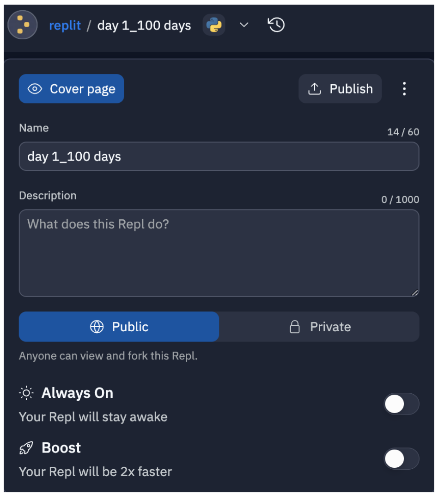
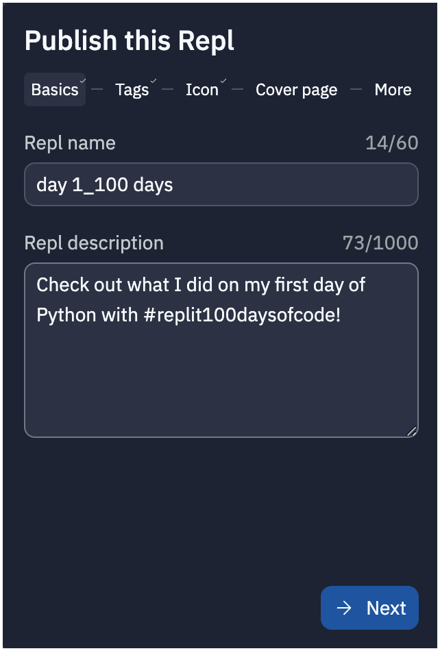
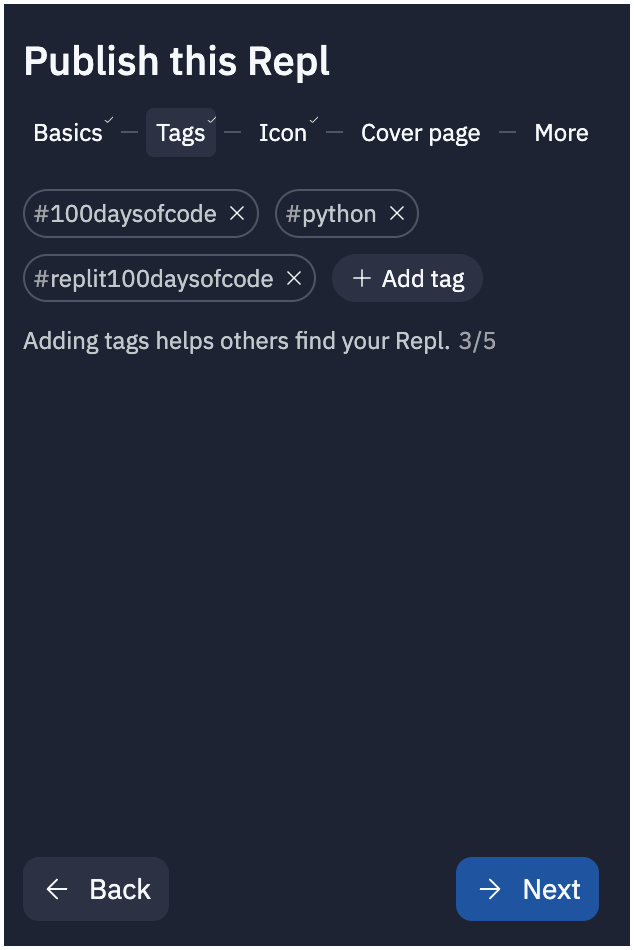
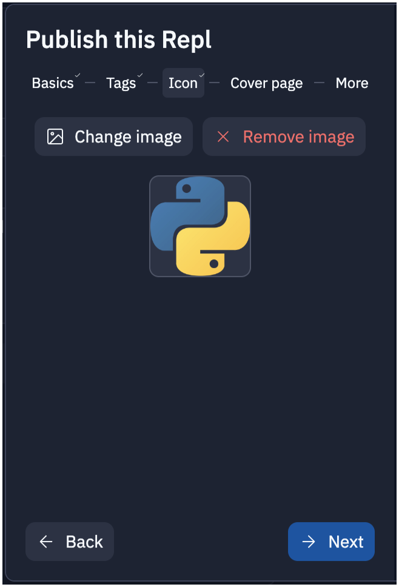
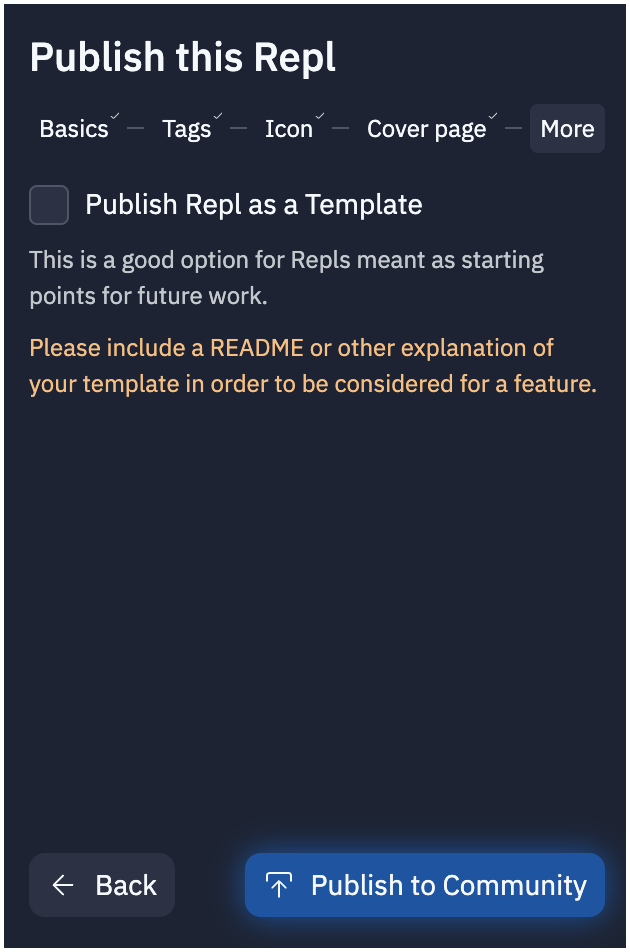

# Share Your Code

You created your project! Now that you have the hang of this, let's publish this project to the Replit community. 🥳

### Hit that **publish** button by clicking the &#8595; arrow button next to your username on the top **left**.

### Give your project a name and a description (ex: "My Adventure Story")
   

### Add the hashtag `#replit100daysofcode` so people in the community can find it when they search. (You could also add `#python` or any other tags you want).

### Upload any image you want for the icon... 

### and cover photo.

### No need to publish as a template, so just click  `Publish to Community` button at the bottom and you've done it!

### Learn more
To learn more about publishing repls, visit our [docs](https://docs.replit.com/hosting/sharing-your-repl#publish).

Join our [100 Days of Code Community](https://ask.replit.com/t/about-100-days-of-code/) and our [Discord channel](https://discord.gg/replit).
  

